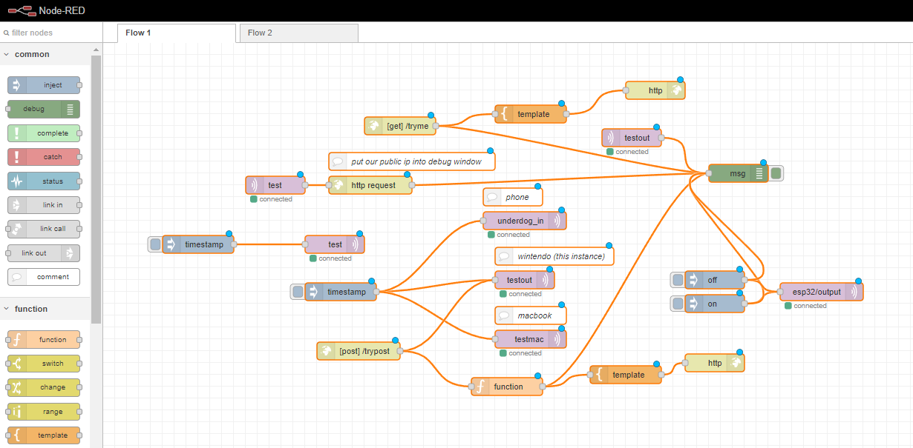

# simple wifi example

This example borrows from the great tutorials over at [random nerd tutorials](https://randomnerdtutorials.com/projects-esp32/).

## node-red-flow

I've attached the json for a node red flow. This node red flow has a lot more than the esp32 code in it, but does a fair job of demonstrating how flexible IBM's little low-code environment can be.



## config-wifi.ino

This project uses the Preferences library to set a key value pair in non-volatile memory. This way we can store our password by uploading a sketch once, and then our regular sketch can do the heavy lifting.

## mqtt-led-example.ino

- Gathers credentials from preferences nvm
- Uses those credentials to connect to a wifi network
- sets the system time from an ntp server
- subscribes to an mqtt topic
- listens for "on" or "off" on the mqtt topic, and sets the onboard LED accordingly

Here is an example of the serial output after the led has been toggled a few times.

``` 
ets Jul 29 2019 12:21:46

rst:0x1 (POWERON_RESET),boot:0x13 (SPI_FAST_FLASH_BOOT)
configsip: 0, SPIWP:0xee
clk_drv:0x00,q_drv:0x00,d_drv:0x00,cs0_drv:0x00,hd_drv:0x00,wp_drv:0x00
mode:DIO, clock div:1
load:0x3fff0018,len:4
load:0x3fff001c,len:1216
ho 0 tail 12 room 4
load:0x40078000,len:10944
load:0x40080400,len:6388
entry 0x400806b4
E (47) psram: PSRAM ID read error: 0xffffffff
Waiting for WiFi... .........
WiFi connected
IP address: 
10.0.0.166


Monday, February 28 2022 01:47:35
attempting mqtt connection
connected
Message arrived on topic: esp32/output. Message: on
Changing output to on
Message arrived on topic: esp32/output. Message: off
Changing output to off
Message arrived on topic: esp32/output. Message: on
Changing output to on
Message arrived on topic: esp32/output. Message: off
Changing output to off
```