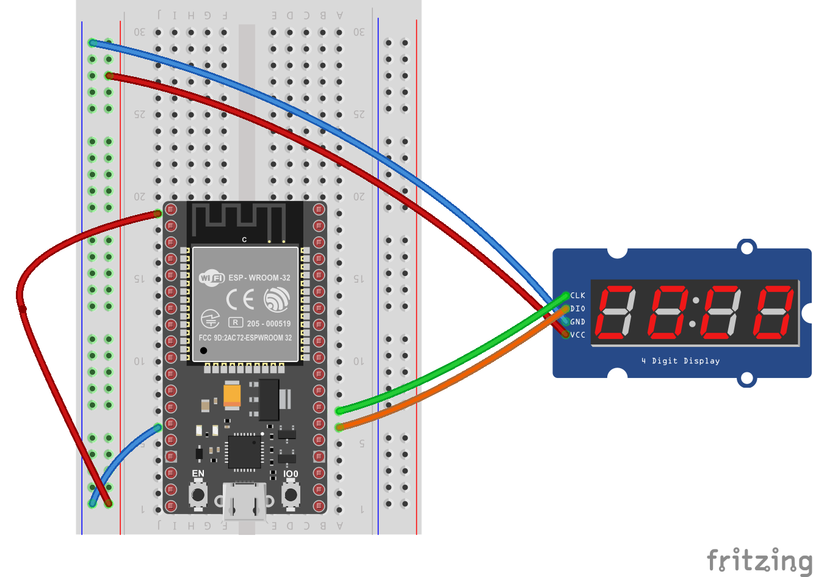

## Get Facebook Page Likes

If you're an admin for a facebook page, this could be of interest.

There's a flow in here for authenticating to a page using your app / user credentials.

Every 60 seconds, it pulls the "fan_count" of a page, which IIRC is the number of page likes.

In retrospect, the json and http libraries aren't really necessary. There would be a lot more room for things that microcontrollers are good at (sensors, servos, displays, physical inputs) if I just tore all that out and used a tcp socket connection to pull the data off of a server on the Internet that handles the json and rest calls to the graph api, and just serves the int, because the binary that comes out of this thing is almost a full MB. A 1MB binary is tight fight on something like an ESP-01.

### Wiring

Here's a Fritzing diagram of how I wired it up.



### Sample Ouptut

```
Connecting to wifi
.........getting fan count
Hope For Pits has 1926 likes!
getting fan count
Hope For Pits has 1926 likes!
```

## Goal

Getting the int for fan_count is really just the start. My plan is to display the value on a big LED reader board, or at least a 4-digit 7-segment display.

### TODO

- make it wifi configurable
- pair down the BOM to make it cheap

## update 

Managed to get this working with a TM1637-driven 4-digit led display.

The code required to drive the display was nothing compared to the tom-foolery required with the facebook graph api.


