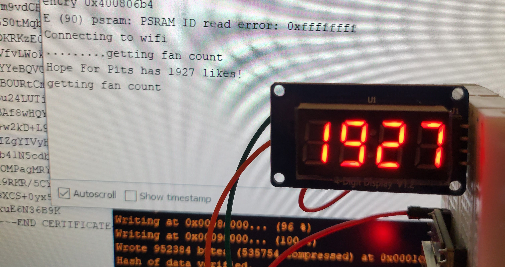

## Get Facebook Page Likes

If you're an admin for a facebook page, this could be of interest.

There's a flow in here for authenticating to a page using your app / user credentials.

Every 60 seconds, it pulls the "fan_count" of a page, which IIRC is the number of page likes.

### Sample Ouptut

```
Connecting to wifi
.........getting fan count
Hope For Pits has 1926 likes!
getting fan count
Hope For Pits has 1926 likes!
```

## Goal

Getting the int for fan_count is really just the start. My plan is to display the value on a big LED reader board, or at least a 4-digit 7-segment display.

## update 

Managed to get this working with a TM1637-driven 4-digit led display.

The code required to drive the display was nothing compared to the tom-foolery required with the facebook graph api.

